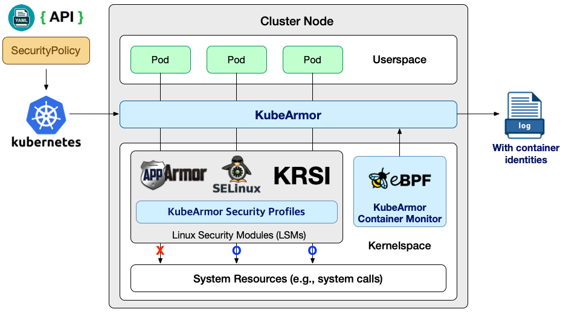

# KubeArmor

## Introduction to KubeArmor

KubeArmor is a container-aware runtime security enforcement system that restricts the behavior \(such as process execution, file access, and networking operation\) of containers at the system level.

KubeArmor operates with [Linux security modules \(LSMs\)](https://en.wikipedia.org/wiki/Linux_Security_Modules), meaning that it can work on top of any Linux platforms \(such as Alpine, Ubuntu, and Container-optimized OS from Google\) if Linux security modules \(e.g., [AppArmor](https://en.wikipedia.org/wiki/AppArmor), [SELinux](https://en.wikipedia.org/wiki/Security-Enhanced_Linux), or [KRSI](https://lwn.net/Articles/808048/)\) are enabled in the Linux Kernel. KubeArmor will use the appropriate LSMs to enforce the required policies.

KubeArmor is designed for Kubernetes environments; thus, operators only need to define security policies and apply them to Kubernetes. Then, KubeArmor will automatically detect the changes in security policies from Kubernetes and enforce them to the corresponding containers.

If there are any violations against security policies, KubeArmor immediately generates alerts with container identities. If operators have any logging systems, it automatically sends the alerts to their systems as well.

## Functionality Overview

* Restrict the behavior of containers at the system level

Traditional container security solutions \(e.g., Cilium\) mostly protect containers by determining their inter-container relations \(i.e., service flows\) at the network level. In contrast, KubeArmor prevents malicious or unknown behaviors in containers by specifying their desired actions \(e.g., a specific process should only be allowed to access a sensitive file\).

For this, KubeArmor provides the ability to filter process executions, file accesses, and even network operations inside containers at the system level.

* Enforce security policies to containers in runtime

In general, security policies \(e.g., Seccomp and AppArmor profiles\) are statically defined within pod definitions for Kubernetes, and they are applied to containers at creation time. Then, the security policies are not allowed to be updated in runtime.

To avoid this problem, KubeArmor maintains security policies separately, which means that security policies are no longer tightly coupled with containers. Then, KubeArmor directly applies the security policies into Linux security modules \(LSMs\) for each container according to the labels of given containers and security policies.

* Produce container-aware alerts and system logs

LSMs do not have any container-related information; thus, they generate alerts and system logs only based on system metadata \(e.g., User ID, Group ID, and process ID\). Therefore, it is hard to figure out what containers cause policy violations.

To address this problem, KubeArmor uses an eBPF-based system monitor, which keeps track of process life cycles in containers, and converts system metadata to container identities when LSMs generate alerts and system logs for any policy violations from containers.

* Provide easy-to-use semantics for policy definitions

KubeArmor provides the ability to monitor the life cycles of containers' processes and take policy decisions based on them. In general, it is much easier to deny a specific action but it is more difficult to allow only specific actions while denying all. KubeArmor manages internal complexities associated with handling such policy decisions and provides easy semantics towards policy language.

* Support network security enforcement among containers

KubeArmor aims to protect containers themselves rather than interactions among containers. However, using KubeArmor a user can add policies that could apply policy settings at the level of network system calls \(e.g., bind\(\), listen\(\), accept\(\), and connect\(\)\), thus somewhat controlling interactions among containers.

## Getting Started

Please take a look at the following documents.

1. [Deployment Guide](getting-started/deployment_guide.md)
2. [Security Policy Specification](getting-started/security_policy_specification.md)
3. [Security Policy Examples](getting-started/security_policy_examples.md)

If you want to make a contribution, please refer to the following documents too.

1. [Contribution Guide](contribution/contribution_guide.md)
2. [Development Guide](contribution/development_guide.md)
3. [Technical Roadmap](contribution/technical_roadmap.md)

## Community

* Slack

  Please join the [KubeArmor Slack channel](https://kubearmor.herokuapp.com) to communicate with KubeArmor developers and other users. We always welcome having a discussion about the problems that you face during the use of KubeArmor.

## License

KubeArmor is licensed under the Apache License, Version 2.0.  
The eBPF-based container monitor is licensed under the General Public License, Version 2.0.

## Notice/Credits

* KubeArmor uses [Tracee](https://github.com/aquasecurity/tracee/)'s system call handling functions developed by [Aqua Security](https://aquasec.com).
